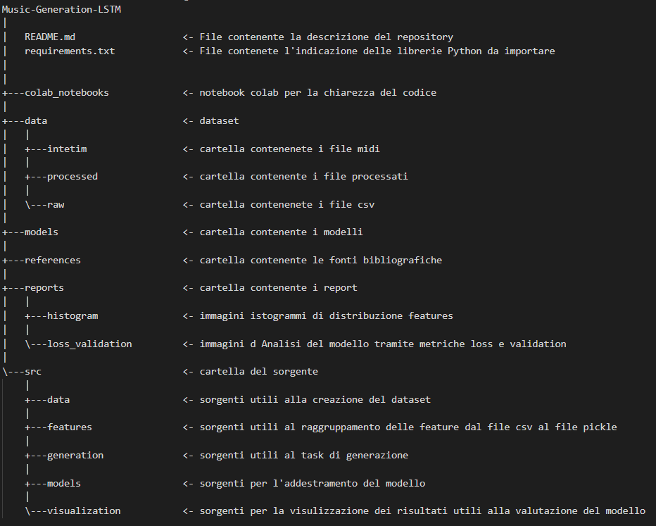

# Music-Generation-LSTM
Lavoro di tesi sulla generazione musicale con approccio LSTM

# Descrizione del contenuto
#### struttura della source directory



NOTA -> per una comprensione dei sorgenti di src di:

- generation
- models
- visualization

consultare i file colab contenuti nella directory colab_notebooks
# Istruzioni di installazione package
### Invoca il comandi
```
source MSL/Scripts/activate
pip install -r requirements.txt
```
# Istruzioni creazione dataset
### Una volta collezionato il set di brani midi invocare in data
```
python midi_to_csv.py nome_set_midi
python create_dataset.py --> (con modifica della funzione nel sorgente create_dataset("../../data/interim/dataset_csv.csv","../../data/processed/dataset_pickle.pickle"))
```


